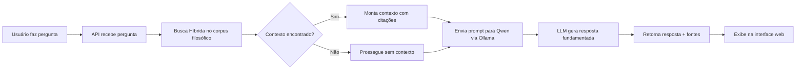

# 🏛️ Agente Filósofo - FiloQuest

<div align="center">


</div>

---

## 📖 Sobre o Projeto

O **Agente Filósofo** é um sistema avançado de inteligência artificial que combina técnicas de **RAG (Retrieval-Augmented Generation)** com modelos de linguagem locais para fornecer respostas filosóficas fundamentadas em textos clássicos da filosofia.

O sistema permite que usuários façam perguntas sobre ética, moral, justiça e outros temas filosóficos, recebendo respostas contextualizadas baseadas em obras de filósofos como:

- **Aristóteles** - Ética a Nicômaco
- **Immanuel Kant** - Metafísica dos Costumes
- **Jeremy Bentham** - Utilitarismo
- **Twine Interactive Fiction** - Dilema do Bonde

---

## 🎯 Principais Funcionalidades

### ✨ Agente Filósofo Inteligente

O coração do sistema é o **Agente Filósofo**, um assistente de IA especializado que:

1. **Compreende Perguntas Complexas**: Processa questões filosóficas em linguagem natural
2. **Busca Contexto Relevante**: Utiliza um sistema híbrido de busca para encontrar trechos relevantes nos textos filosóficos
3. **Gera Respostas Fundamentadas**: Produz respostas baseadas no contexto encontrado, citando as fontes originais
4. **Mantém Persona Filosófica**: Responde com o tom e profundidade adequados a questões filosóficas

## 🏗️ Arquitetura do Sistema

```
┌─────────────────────────────────────────────────────────────┐
│                     FRONTEND (HTML/CSS/JS)                   │
│  ┌─────────────┐  ┌──────────────┐  ┌─────────────────────┐ │
│  │ Contexto    │  │ Área de      │  │ Modal               │ │
│  │ Histórico   │  │ Interação    │  │ Flashcard           │ │
│  └─────────────┘  └──────────────┘  └─────────────────────┘ │
└─────────────────────────────────────────────────────────────┘
                            ↓ HTTP POST /perguntar
┌─────────────────────────────────────────────────────────────┐
│                  API FastAPI (api_agente.py)                 │
│  ┌──────────────────────────────────────────────────────┐   │
│  │  Endpoint: POST /perguntar                           │   │
│  │  1. Recebe pergunta do usuário                       │   │
│  │  2. Chama BuscaFilosofica.busca_hibrida()            │   │
│  │  3. Monta contexto com fontes                        │   │
│  │  4. Envia para LLM (Ollama/Qwen)                     │   │
│  │  5. Retorna resposta + fontes                        │   │
│  └──────────────────────────────────────────────────────┘   │
└─────────────────────────────────────────────────────────────┘
                            ↓
┌─────────────────────────────────────────────────────────────┐
│              BUSCA FILOSÓFICA (busca_filosofica.py)          │
│  ┌─────────────┐  ┌─────────────┐  ┌─────────────────────┐ │
│  │ Busca RAG   │  │ Busca GREP  │  │ Busca Híbrida       │ │
│  │ (Semantic)  │  │ (Keywords)  │  │ (Weighted Combo)    │ │
│  └─────────────┘  └─────────────┘  └─────────────────────┘ │
└─────────────────────────────────────────────────────────────┘
                            ↓
┌─────────────────────────────────────────────────────────────┐
│                    MODELO DE LINGUAGEM                       │
│                    Ollama + Qwen 2.5 3B                      │
│  ┌──────────────────────────────────────────────────────┐   │
│  │  Prompt Especializado:                               │   │
│  │  - Recebe contexto dos textos filosóficos            │   │
│  │  - Instruções para citar fontes                      │   │
│  │  - Gera resposta fundamentada                        │   │
│  └──────────────────────────────────────────────────────┘   │
└─────────────────────────────────────────────────────────────┘
```

---

## 🚀 Como Funciona o Agente Filósofo

### Fluxo de Processamento



### Detalhamento do Pipeline

#### 1. Recepção da Pergunta
```python
@app.post("/perguntar")
def responder(pergunta: Pergunta):
    # Recebe: {"texto": "O que é justiça para Platão?"}
```

#### 2. Busca de Contexto
```python
resultados = buscador.busca_hibrida(pergunta.texto, top_k=1)
score_final = 0.7 * rag_score + 0.3 * grep_score
```

#### 3. Montagem do Prompt
```python
prompt = f"""Você é um filósofo especialista.
Você tem acesso ao seguinte trecho de texto filosófico:

--- INICIO DO CONTEXTO ---
{contexto}
--- FIM DO CONTEXTO ---

INSTRUÇÃO OBRIGATÓRIA:
1. NÃO use o seu conhecimento interno sobre o filósofo.
2. Use APENAS as palavras do texto acima.
3. Na sua resposta, comece com: "No texto fornecido, o autor diz que..."
4. Depois, explique essa citação com suas palavras.

Pergunta: {pergunta}
"""
```

#### 4. Geração da Resposta
```python
response = requests.post(
    "http://localhost:11434/api/generate",
    json={"model": "qwen2.5:3b", "prompt": prompt, "temperature": 0.3}
)
```

#### 5. Retorno Estruturado
```json
{
  "pergunta": "O que é justiça?",
  "resposta": "No texto fornecido, o autor diz que...",
  "contexto_usado": true,
  "fontes": ["kant_metafisica-costumes.txt"]
}
```

---

## 📁 Estrutura do Projeto

```
/workspace
├── README.md
├── requirements.txt
├── frontend/
│   ├── index.html
│   ├── style.css
│   ├── script.js
│   └── image_b16420.jpg
├── scripts/
│   ├── agente_filosofo.py
│   ├── api_agente.py
│   ├── busca_filosofica.py
│   └── ...
└── docs/
    ├── aristoteles_etica-e-nicomaco.txt
    ├── kant_metafisica-costumes.txt
    ├── jeremy_utilitarismo.txt
    ├── embeddings_filosofia.json
    └── texto_filosofico_fatiado.json
```

---

## 🛠️ Instalação

### Pré-requisitos
- Python 3.8+
- Ollama instalado
- Modelo Qwen 2.5 3B

### Passos

```bash
cd /workspace
python -m venv venv
source venv/bin/activate
pip install -r requirements.txt

# Configurar Ollama
curl -fsSL https://ollama.com/install.sh | sh
ollama pull qwen2.5:3b
ollama serve
```

---

## 🚀 Como Usar

### Via Interface Web
```bash
cd scripts && python api_agente.py
cd frontend && python -m http.server 8080
# Acesse http://localhost:8080
```

### Via CLI
```bash
cd scripts && python agente_filosofo.py
```

### Via API
```bash
curl -X POST http://localhost:8000/perguntar \
  -H "Content-Type: application/json" \
  -d '{"texto": "O que Kant diz sobre o imperativo categórico?"}'
```

---

## 📊 Corpus Filosófico

| Filósofo | Obra | Tema |
|----------|------|------|
| Aristóteles | Ética a Nicômaco | Virtude, Eudaimonia |
| Kant | Metafísica dos Costumes | Imperativo Categórico |
| Bentham | Utilitarismo | Princípio da Felicidade |
| Twine IF | Dilema do Bonde | Dilemas Morais |

---

## ⚙️ Configurações

- `top_k=1` - Melhor resultado
- `temperature=0.3` - Respostas focadas
- `rag_weight=0.7` - 70% semântico
- `grep_weight=0.3` - 30% keywords
- Embedding: `all-MiniLM-L6-v2`

---

## 🐛 Troubleshooting

**Ollama não responde:**
```bash
ps aux | grep ollama
ollama serve
```

**Embeddings não encontrados:**
```bash
cd scripts && python gerar_embeddings.py
```

**Modelo Qwen não disponível:**
```bash
ollama pull qwen2.5:3b
```

## 📚 Referências

- Ollama: https://ollama.com
- Sentence Transformers: https://www.sbert.net
- FastAPI: https://fastapi.tiangolo.com

</div>
